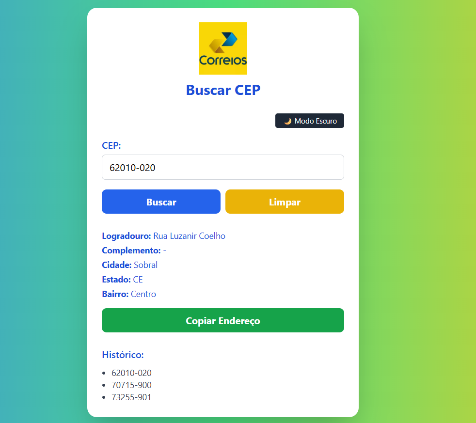
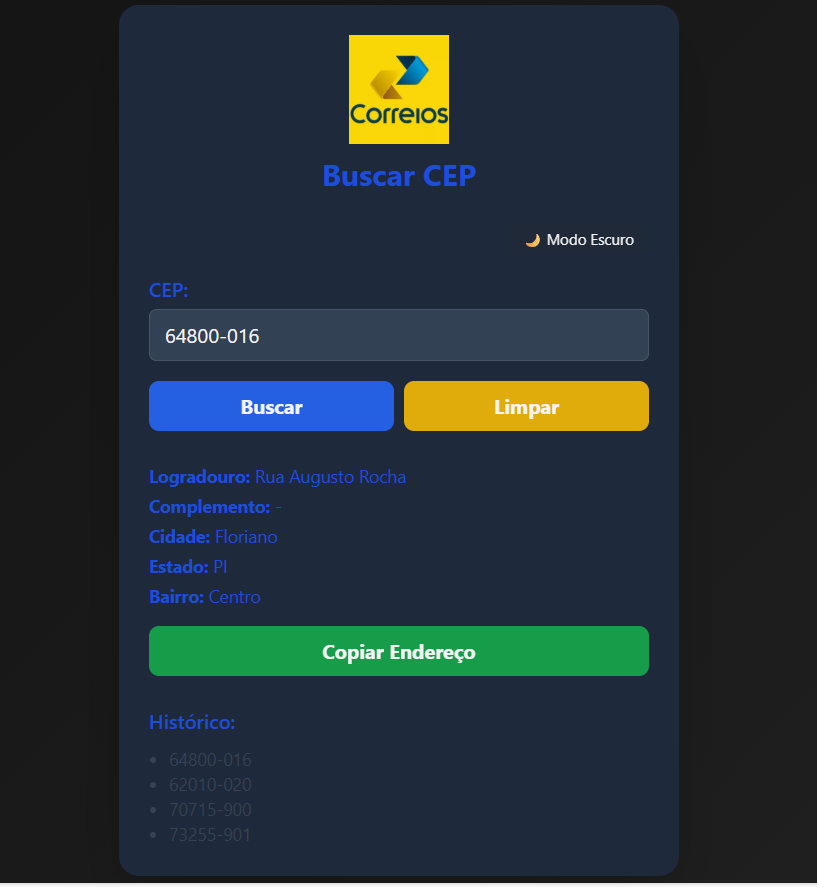
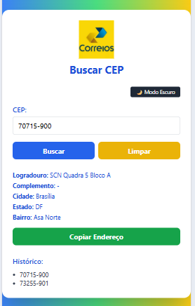
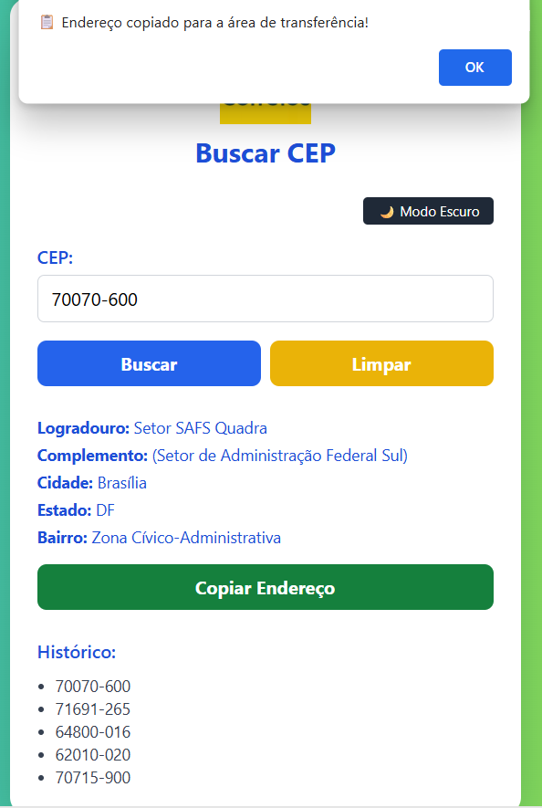

# 📮 Buscar CEP

Aplicação web para consultar endereços a partir de um CEP, consumindo a API pública [ViaCEP](https://viacep.com.br/).  
O projeto foi feito em **HTML**, **JavaScript** e estilizado com **TailwindCSS**, com foco em aprendizado e boas práticas.

---

## 📋 Como funciona
1. Digite um CEP válido no campo de entrada.  
2. Clique no botão **"Buscar"**.  
3. O endereço será exibido na tela com logradouro, bairro, cidade e estado.  
4. Use o botão **"Limpar"** para reiniciar.  
5. É possível **copiar o endereço** para a área de transferência.  
6. O sistema mantém um **histórico** com os últimos 5 CEPs pesquisados.  
7. Há suporte a **modo claro 🌞 e escuro 🌙**.  

---

## ✨ Funcionalidades
- Máscara automática no campo de CEP.  
- Busca de endereço pela API ViaCEP.  
- Loader animado durante a requisição.  
- Botão para copiar endereço 📋.  
- Histórico das últimas buscas (até 5 CEPs).  
- Dark mode com alternância dinâmica.  
- Layout responsivo (desktop e mobile).  

---

## 🛠 Tecnologias
- **HTML5** – Estrutura da aplicação.  
- **CSS3 + TailwindCSS** – Estilização e responsividade.  
- **JavaScript (ES6)** – Lógica e integração com a API.  
- **API ViaCEP** – Fonte dos dados de endereço.  

---

## 📸 Screenshots

### 💻 Versão Desktop

### 🌙 Versão Desktop – Dark Mode

### 📱 Versão Mobile

### 📋 Copiando endereço para área de transferência

---

## 👨‍💻 Autor
Márcio Xavier – [xaviermarcio80@gmail.com](mailto:xaviermarcio80@gmail.com)

