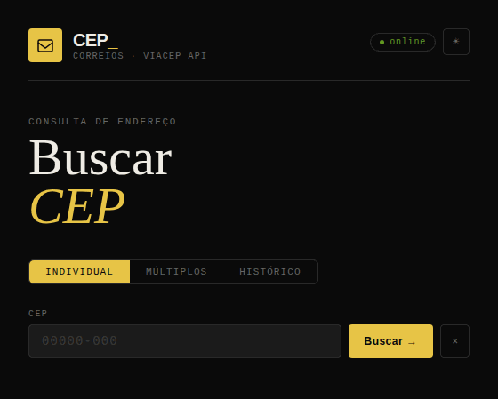
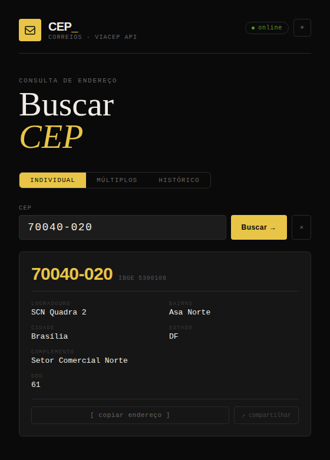
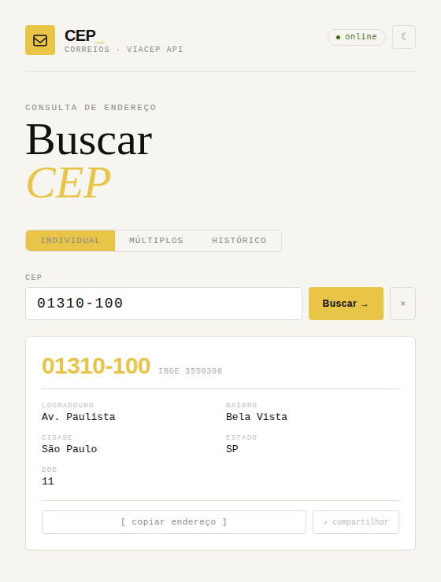
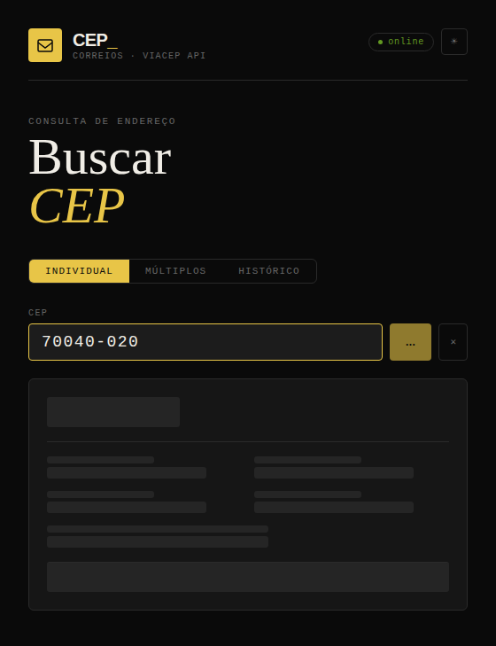
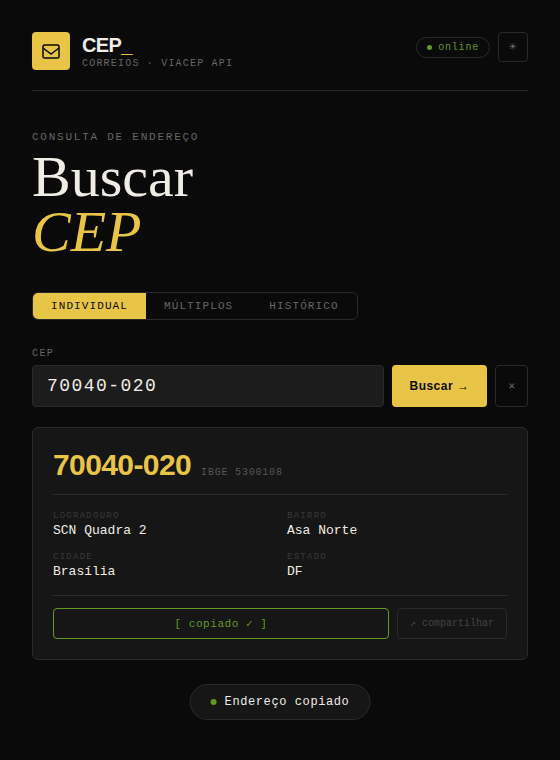
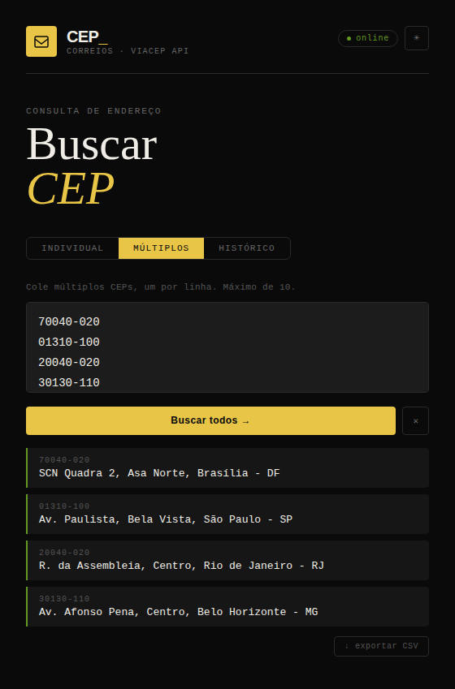
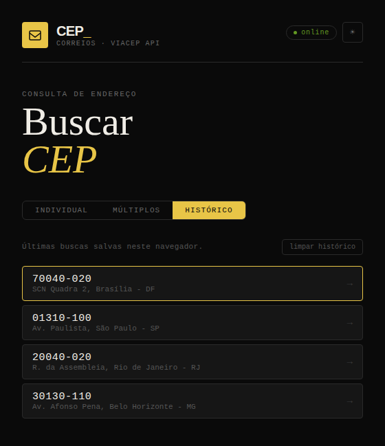
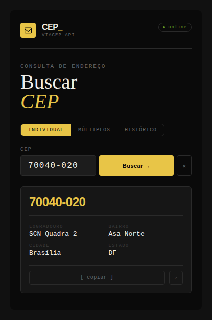

# CEP_ — Buscar Endereço

[]()
[]()
[]()
[]()
[]()

Aplicação web para consultar endereços brasileiros a partir de um CEP, consumindo a API pública [ViaCEP](https://viacep.com.br/).  
Projeto v2 — redesign editorial bold, PWA completo, busca em lote e validação robusta.

---

## 🎬 Demo



---

## 📸 Screenshots

| Dark mode | Light mode |
|:---------:|:----------:|
|  |  |

| Skeleton loader | Toast ao copiar |
|:--------------:|:--------------:|
|  |  |

| Busca em lote + CSV | Histórico |
|:-------------------:|:---------:|
|  |  |

| Mobile |
|:------:|
|  |

---

## ✨ Funcionalidades

### Busca
- Busca individual com máscara automática (00000-000)
- Validação robusta: formato e sequências triviais (00000000, 11111111…)
- Exibe: logradouro, bairro, cidade, estado, complemento, DDD e código IBGE
- Busca em lote: cole até 10 CEPs, um por linha, com throttle entre requisições

### Histórico & Exportação
- Histórico persistido com logradouro e cidade (até 10 entradas)
- Clique no histórico para rebuscar automaticamente
- Exportação do lote em **CSV com BOM UTF-8** (abre direto no Excel)

### Interface
- Design editorial: DM Serif Display + DM Mono + Syne
- Dark mode (padrão) e Light mode persistidos via `localStorage`
- Respeita `prefers-color-scheme` na primeira visita
- Skeleton loader durante requisições
- Toast de feedback ao copiar endereço
- Status online/offline em tempo real
- Web Share API no mobile
- Totalmente responsivo (mobile-first)

### PWA
- Manifest com ícones, nome curto e atalho de tela inicial
- Service Worker — **cache-first** para assets, **network-first** para API com fallback offline
- Prompt de atualização ao detectar nova versão

### Segurança & Qualidade
- Timeout de 8s com `AbortSignal.timeout`
- Tratamento de erros HTTP, timeout e offline
- Sem dependências externas (zero npm, zero frameworks)
- `'use strict'` em todo o JS
- Acessibilidade: skip link, `role="tablist"`, `aria-selected`, `aria-live`, `aria-label`

---

## 🗂 Estrutura

```
buscar-cep/
├── index.html          ← Estrutura semântica + acessibilidade
├── manifest.json       ← PWA manifest
├── sw.js               ← Service Worker (offline)
├── icons/
│   ├── icon-192.png    ← Ícone PWA 192×192
│   └── icon-512.png    ← Ícone PWA 512×512
└── src/
    ├── css/
    │   └── style.css   ← Design system + temas dark/light
    ├── img/            ← Screenshots e demo.gif
    └── js/
        └── cep.js      ← Toda a lógica da aplicação
```

---

## 🛠 Tecnologias

| Camada | Tecnologia |
|--------|-----------|
| Estrutura | HTML5 semântico |
| Estilo | CSS3 puro (variáveis, grid, animações) |
| Lógica | JavaScript ES2022 (`'use strict'`, `AbortSignal.timeout`) |
| Tipografia | DM Serif Display · DM Mono · Syne |
| API | ViaCEP (REST, JSON) |
| PWA | Web App Manifest + Service Worker |
| Clipboard | Clipboard API + `execCommand` fallback |
| Share | Web Share API |

---

## 🚀 Como usar

1. Clone o repositório
2. Adicione os ícones PWA em `icons/icon-192.png` e `icons/icon-512.png`
3. Sirva com qualquer servidor HTTP:

```bash
npx serve .
# ou Live Server no VS Code
```

4. Para testar offline: DevTools → Application → Service Workers → Offline

> Não é necessário build, bundler ou instalação de dependências.

---

## 👨‍💻 Autor

Márcio Xavier — [xaviermarcio80@gmail.com](mailto:xaviermarcio80@gmail.com)
